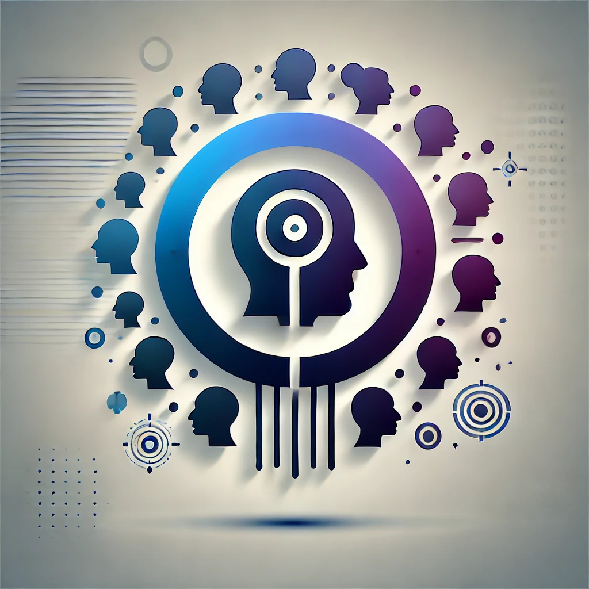

# Multiple-Speakers-Personality-Detection

This project provides an advanced AI system designed for diagnosing and profiling personality attributes from video content based on a single speaker or multiple speakers in a conversation.   

It transcribes video content, identifies speakers, and performs a comprehensive analysis of attachment styles, Big Five personality traits, and personality disorders.

## Introduction

This project loads a video file and generates a transcript with speaker identification for each of their texts. It utilizes a Large Language Model (LLM), enhanced with external knowledge input and task instructions using Retrieval-Augmented Generation (RAG) techniques to detect personality types of the different speakers involved in the video.

Additionally, the system can process and analyze interpersonal dynamics and conversations from the transcription, as each line of text is attributed to a specific speaker. This enables the LLM to identify interpersonal communication patterns and analyze them to derive meaningful psychological and personality insights.

**Important Disclaimer:** The insights provided by this system are not clinical diagnoses. They should not be considered as professional psychological or psychiatric evaluations. For any real clinical assessment or diagnosis, it is essential to consult a licensed psychologist or psychiatrist.

## Features

- **Transcription & Diarization**: Uses AWS Transcribe to convert speech to text and label different speakers.
- **Personality Analysis**: Provides comprehensive analysis based on:
  - Overall Personality Impressions
  - Attachment styles
  - Big Five personality traits
  - Personality disorders
- **RAG Techniques**: Employs RAG to integrate external knowledge data and task-specific instructions, enhancing the analysis accuracy.
- **Data Visualization**: Visualizes the analysis results using interactive plots and charts.
- **User-Friendly Interface**: Simple to use interface built with Gradio.

## RAG (Retrieval-Augmented Generation)

RAG is a technique that combines retrieval and generation to answer questions or complete tasks. It works by first retrieving relevant documents from a large corpus and then using those documents to generate an answer with a language model.

**How RAG Uses Embeddings with FAISS:**

1. **Embeddings:**
   - RAG converts both the query and the documents into dense vector embeddings that capture their semantic meaning.

2. **FAISS Integration:**
   - FAISS is used to index and search these embeddings. When a query is made, FAISS quickly retrieves the most relevant documents by comparing the query's embedding to the document embeddings using Approximate Nearest Neighbor (ANN) search.

3. **Answer Generation:**
   - The retrieved documents' embeddings are then fed into a language model, which generates a context-aware answer based on the most relevant documents.

### Knowledge Corpus:
The source material used for embedding consists of academic documents on attachment styles and personalities, all with high theoretical and empirical validity. This collection also includes relevant questionnaires and diagnostic manuals such as DSM-5 and PDM-2.

## Workflow Overview

- **Diarization**: Identify and label speakers in the video.    
- **Identify Language**: Detect the language of the conversation.   
- **Transcription**: Convert spoken content into written text.   
- **Transcript by Speakers**: Create a structured transcript with speaker labels.   
- **Knowledge Integration**: Enhance the LLM with external knowledge about Attachments, Big Five traits, and Personalities.   
- **Task Definition**: Define specific tasks that guide the LLM on how to analyze the transcript.   
- **LLM Processing**: Use the LLM to analyze the transcript according to the tasks and integrated knowledge.   
- **Parse and Format Outputs**: Structure the analysis results into human-readable formats.

## Technical Details

- **Transcription & Diarization (AWS Transcribe)**: The audio is transcribed to text, with speaker diarization to label each segment by different speakers.
- **Embeddings & QA Retrieval**: Embeddings are generated, which are used in a question-answer retrieval system augmented by external knowledge and specific tasks.
- **Tasks & Knowledge**: Task-specific instructions and knowledge sources are employed to guide the LLM in analyzing the transcript.
- **LLM (ChatOpenAI)**: The Large Language Model processes the transcript using the task instructions and knowledge.
- **Output Parsing**: The results are parsed and formatted.
- **Results**: Final results are generated, which include visualizations and detailed analyses.

